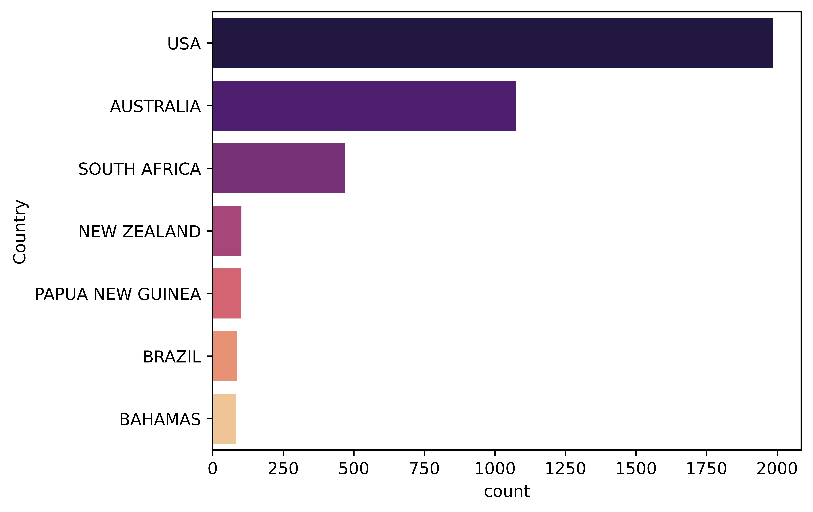
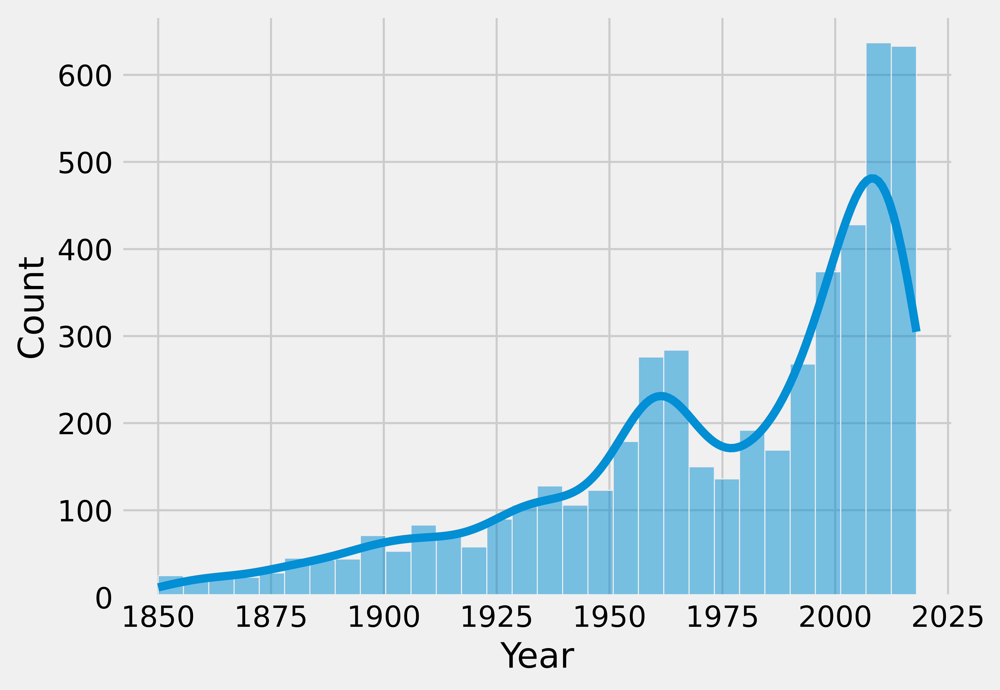
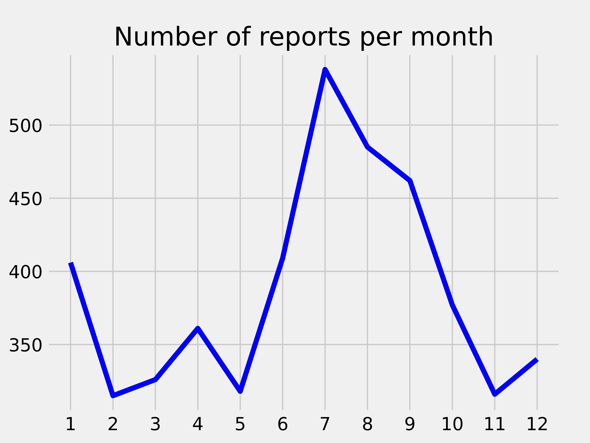

  # 1. INTRODUCTION

The process that I have completed on the next steps is based on a dataframe called `attacks.csv` with data from different shark attacks on people from a period over 2000 years. The dataset contains information from dates, sex, activity... collected from the attacks.

The first step of the process was an initial visualization of the data and the establishment of diferent hypothesis based on it. 

The information on the dataset is not clear and may of the rows of the set, are completed with empty values and in total have more than 25000 rows. However, there is enough information to make some initial hypothesis.


# 1.1. HYPHOTESIS

I make the next ones, based on the first visualization:

  -  There is a direct relation between the sport or activity that the victim is practizing and the number of attacks. Sharks may be attracted to the shape of the boards (surf, paddleboards...) more than to the people swimming.
  

 -  There is also a direct relation between the time of the day of the attack and the number of them that are produced (There are more attacks around noon). This may be related to the activity time of the sharks but also to the fact that their sight is [photosensitive](https://www.epicdiving.com/shark-vision/) and the sunlight is more intense and proyected on the water around noon.


# 2. CLEANING PROCESS

First of all I begin deleting the columns that are not direct-related to my hypothesis, that have too many Nan values or have repeated data.

```
attacks = attacks.drop(["Unnamed: 22", "Unnamed: 23", "original order", "href formula", "href", "Case Number.1","Case Number.2", "pdf", "Case Number", "Species", "Name", "Age", "Injury", "Location"], axis = 1)
attacks.dropna(axis=0, inplace=True, thresh=9)
attacks.reset_index(drop = True)
```
With this lines of code, we reduce the numbers of columns from 24 to 10, deleting much of the Nan values and keeping only 4952 rows.

 - Cleaning Date and Year column and creating Month and a new Year

First of all we create another Year column and we move all the values from the previous one converting them to strings.

Using a function that we defined earlier, we move the values of the Date column to the Year, only to the positions where the value in the last one is empty. 

```
%run Functions.ipynb

move_info(list(attacks_filtered["NewYear"]), list(attacks_filtered["Date"]))

``

Once there we apply another two regex function in order to keep only the year of the date.

pattern_2 = "\d{4}"
pattern_3 = "(\d+)[^-]*$"

attacks_filtered["NewYear"] = attacks_filtered["NewYear"].apply(lambda x: re.findall(pattern_2, str(x)))
attacks_filtered["NewYear"] = attacks_filtered["NewYear"].apply(lambda x: re.findall(pattern_3, str(x)))
attacks_filtered["Year"] = attacks_filtered["NewYear"].explode().astype("object")
attacks_filtered = attacks_filtered.drop(["NewYear"], axis = 1)
```

In order to get the month of the the Date we appply some other lambda functions combined with Regex:

```
pattern_4 = "([a-z|A-Z]{3})"
pattern_5 = "(?:Jan|Feb|Mar|Apr|May|Jun|Jul|Aug|Sep|Oct|Nov|Dec)"
pattern_6 = "^\S*"


attacks_filtered["Month"] = attacks_filtered["Date"].apply(lambda x: re.findall(pattern_4, str(x))).apply(lambda x: ' '.join(x))
attacks_filtered["Month"] = attacks_filtered["Month"].apply(lambda x: re.findall(pattern_5, str(x))).apply(lambda x: ' '.join(x))
attacks_filtered["Month"] = attacks_filtered["Month"].apply(lambda x: re.findall(pattern_6, str(x))).apply(lambda x: ' '.join(x))
attacks_filtered = attacks_filtered.drop(["Date"], axis = 1)
```
 - Cleaning the activity column

For the column of activity I applied a regex in a Dict, filtering an reducing the diferent values. Doing this, we will try to validate our hypothesis on an easier way.

```
dict_time = {"Swimming related": ".*(swim).*|.*(Swim).*",
"Board involved activity": ".*(Surf).*|.*(surf).*|.*(Board).*|.*(board).*|.*(Pad).*|.*(pad).*|.*(Kay).*|.*(Canoe).*",
"Fishing related": ".*(fish).*|(Fish).*|.*(Kill).*|.*(Pull).*|.*(Pick).*|.*(feed).*",
"Beach activities":".*(Wad).*|.*(Bath).*|.*(bath).*|.*(Stans).*|.*(Play).*|.*(play).*|.*(Walk).*|.*(walk).*",
"Diving activities": ".*(Div).*|.*(div).*|.*(underw).*|.*(Snork).*",
"Consequence of a shipwreck": ".*(dinghy).*|.*(collide).*|.*(lifeboat).*|.*(explodex).*|.*(skiff).*",
"Consequence of handeling sharks": ".*(Shark).*|.*(shark).*",}

for key, value in dict_time.items():
  attacks_filtered["Activity"] = attacks_filtered["Activity"].str.replace(value, key, regex = True)

```


 - Cleaning the time column
  
We repeat the previous step with the Time column in order to obtain 4 time ranges from the  different time expressions of the values in the dataset. The importance of this step is trying to clasify the maximum number of values, leaving a minnimum amount unclassify(btw, I used another shameful condition):


- Cleaning the Fatal column

On the last steps of the cleaning process we filter the Fatal (Y/N) column with a simple regex getting the Y/N values only:

```
pattern = "^(N|Y)"

attacks_filtered["Fatal (Y/N)"] = attacks_filtered["Fatal (Y/N)"].apply(lambda x: re.findall(pattern, str(x)))
attacks_filtered["Fatal"] = attacks_filtered["Fatal (Y/N)"].explode()
attacks_filtered = attacks_filtered.drop(["Fatal (Y/N)"], axis = 1)
```
- Cleaning the Sex column
  
Finally, we repeat the previous filter on the Sex column, in order to get only values F / M.

# 2. VISUALIZATION

First of all, using a seaborn countplot,  we display the top 7 countries by number of reports:



In addition to the previous graph, we have two plots indicating the number of reports since 1850 to now, were we can confirm the increase of them and the increase as well during summer.





Finally, and related to the second hypothesis explained before, we have first the relation between the time and the number of attacks:


We can see that the time when the number of attacks is bigger is in the morning and specially in the afternoon (around noon) despite most of the shark species have night habits. On the second plot, we have the same graph related to the fatality of the attacks.

On the last of the graphs we have a relation of  between activity, number of attacks and fatality of them:


The last of the graphs is referred to the first of my hypothesis. After filtering and encapsulating the diferent types of activities, we can see that those that envolved a board or paddle, are more likely to suffer an attack from a shark than others like swimming or diving. This might be cause for the shape of the boards or paddels use for this activities.

However, and without having included this on the hypothesis, I have realized that despite suffering more attacks, the fatality is much lower than, swimming, for instance. This might be due to the fact that a board or paddle can actually protect us from a shark attack. This is an underlying hypothesis that I liked to include as well.

I hope you take this into account the next time you go to the beach....

🦈🦈🦈🦈🦈🦈🦈🦈🦈


  


